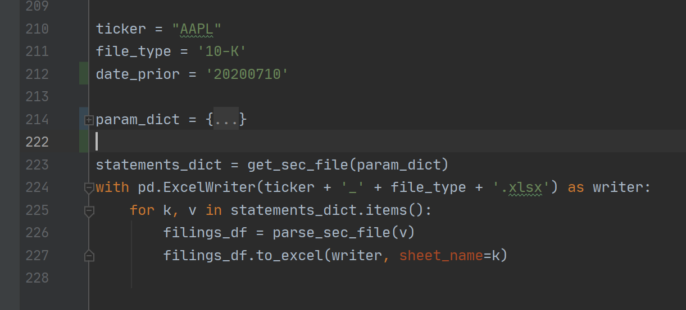
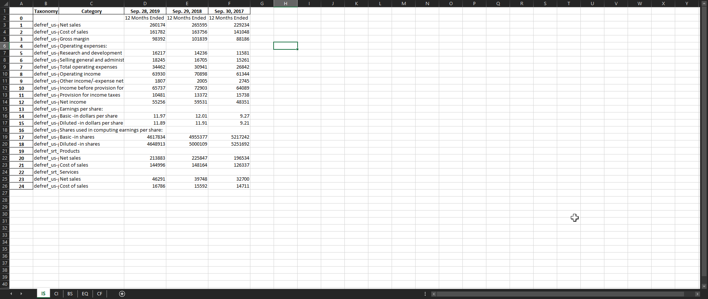

# SEC_Downloader
This code allows you to download SEC financial statements as pandas dataframes and converts it into Excel.
If you have any suggestions on how to improve this project or would like to contribute please let me know.

Why use this code
------------
- By implementing XBRL validation, this code can be used for data mining and mass downloading of SEC filings.

Screenshots
-----------

Requirements
------------
- requests==2.24.0
- pandas==1.1.0
- bs4==0.0.1
- beautifulsoup4==4.9.1
- openpyxl==3.0.4
